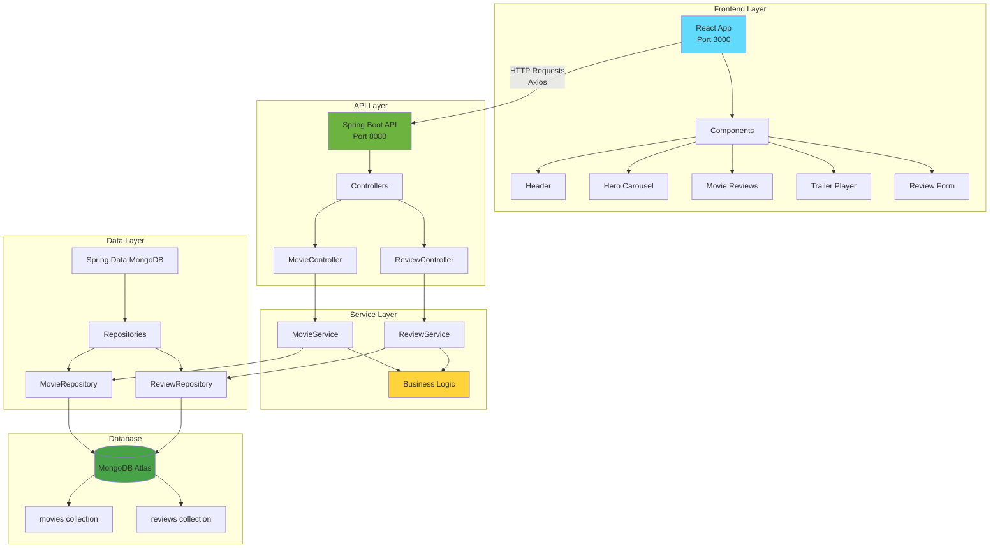

# Movies Review Application

A full-stack web application for viewing and reviewing movies, built with Spring Boot backend and React frontend.

## 🎬 Project Overview

This application allows users to browse movies, watch trailers, and submit reviews. It consists of a RESTful API backend built with Spring Boot and MongoDB, and a responsive React frontend with modern UI components.

## 📋 Table of Contents

- [Architecture](#architecture)
- [Features](#features)
- [Tech Stack](#tech-stack)
- [Project Structure](#project-structure)
- [Prerequisites](#prerequisites)
- [Installation & Setup](#installation--setup)
- [API Endpoints](#api-endpoints)
- [Environment Variables](#environment-variables)
- [Contributing](#contributing)

## 🏗️ Architecture



## ✨ Features

- **Movie Browsing**: View a carousel of featured movies with posters and details
- **Trailer Streaming**: Watch movie trailers using React Player
- **Review System**: Submit and view movie reviews
- **Responsive Design**: Mobile-friendly UI built with React Bootstrap
- **Modern UI**: Material-UI components and FontAwesome icons
- **RESTful API**: Clean API design following REST principles
- **Database Integration**: MongoDB for persistent data storage

## 🛠️ Tech Stack

### Frontend
- **React 18.3.1** - Modern JavaScript framework
- **React Router DOM 6.27.0** - Client-side routing
- **React Bootstrap 2.10.5** - UI component library
- **Material-UI 6.1.5** - React component library
- **Axios 1.7.7** - HTTP client for API requests
- **React Player 2.16.0** - Video player component
- **FontAwesome** - Icon library

### Backend
- **Spring Boot 3.3.5** - Java framework
- **Spring Data MongoDB** - Database abstraction layer
- **Lombok** - Java boilerplate reduction
- **Maven** - Dependency management
- **Java 17** - Programming language

### Database
- **MongoDB Atlas** - Cloud NoSQL database

## 📁 Project Structure

```
moviesReviewApp/
├── moviesBackend/                 # Spring Boot API
│   ├── src/main/java/com/kae_ptl/movies/
│   │   ├── Movie.java            # Movie entity
│   │   ├── Review.java           # Review entity
│   │   ├── MovieController.java  # Movie REST endpoints
│   │   ├── ReviewController.java # Review REST endpoints
│   │   ├── MovieService.java     # Movie business logic
│   │   ├── ReviewService.java    # Review business logic
│   │   ├── MovieRepository.java  # Movie data access
│   │   ├── ReviewRepository.java # Review data access
│   │   └── MoviesApplication.java # Main application
│   ├── src/main/resources/
│   │   └── application.properties # Configuration
│   └── pom.xml                   # Maven dependencies
│
└── moviesFrontend/movie-app-v1/   # React application
    ├── src/
    │   ├── components/           # React components
    │   │   ├── header/          # Navigation header
    │   │   ├── hero/            # Movie carousel
    │   │   ├── home/            # Home page
    │   │   ├── reviewForm/      # Review submission
    │   │   ├── reviews/         # Reviews display
    │   │   └── trailer/         # Video player
    │   ├── api/
    │   │   └── axiosConfig.js   # API configuration
    │   ├── App.js               # Main app component
    │   └── index.js             # Application entry point
    └── package.json             # Node.js dependencies
```

## 📋 Prerequisites

- **Java 17+**
- **Node.js 16+**
- **npm or yarn**
- **MongoDB Atlas account** (or local MongoDB)
- **Maven 3.6+**

## 🚀 Installation & Setup

### 1. Clone the Repository
```bash
git clone <repository-url>
cd moviesReviewApp
```

### 2. Backend Setup

```bash
cd moviesBackend

# Configure environment variables (see Environment Variables section)
# Create .env file or set system environment variables

# Run the Spring Boot application
./mvnw spring-boot:run
```

The backend will start on `http://localhost:8080`

### 3. Frontend Setup

```bash
cd moviesFrontend/movie-app-v1

# Install dependencies
npm install

# Start the React development server
npm start
```

The frontend will start on `http://localhost:3000`

## 🔗 API Endpoints

### Movies
- `GET /api/v1/movies` - Get all movies
- `GET /api/v1/movies/{imdbId}` - Get movie by IMDB ID

### Reviews
- `POST /api/v1/reviews` - Create a new review
- `GET /api/v1/movies/{imdbId}/reviews` - Get reviews for a movie

## 🔐 Environment Variables

Create a `.env` file in the backend directory or set the following environment variables:

```properties
MONGO_DATABASE=your_database_name
MONGO_USER=your_mongodb_username
MONGO_PASSWORD=your_mongodb_password
MONGO_CLUSTER=your_mongodb_cluster_url
```

## 🤝 Contributing

1. Fork the repository
2. Create a feature branch (`git checkout -b feature/amazing-feature`)
3. Commit your changes (`git commit -m 'Add some amazing feature'`)
4. Push to the branch (`git push origin feature/amazing-feature`)
5. Open a Pull Request

## 📝 API Documentation

The application follows RESTful principles with the following data models:

### Movie Model
```json
{
  "id": "ObjectId",
  "imdbId": "string",
  "title": "string",
  "releaseDate": "string",
  "trailerLink": "string",
  "poster": "string",
  "genre": ["string"],
  "backdrops": ["string"],
  "reviewIds": [Review]
}
```

### Review Model
```json
{
  "id": "ObjectId",
  "body": "string"
}
```

## 🎯 Future Enhancements

- User authentication and authorization
- Rating system (star ratings)
- Search functionality
- Movie filtering by genre
- User profiles and favorite movies
- Movie recommendations
- Admin panel for movie management

---

**Built with ❤️ using Spring Boot and React**
